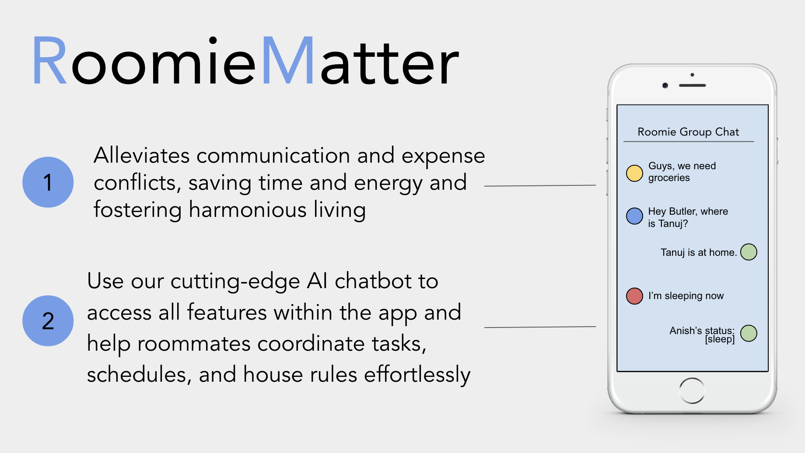
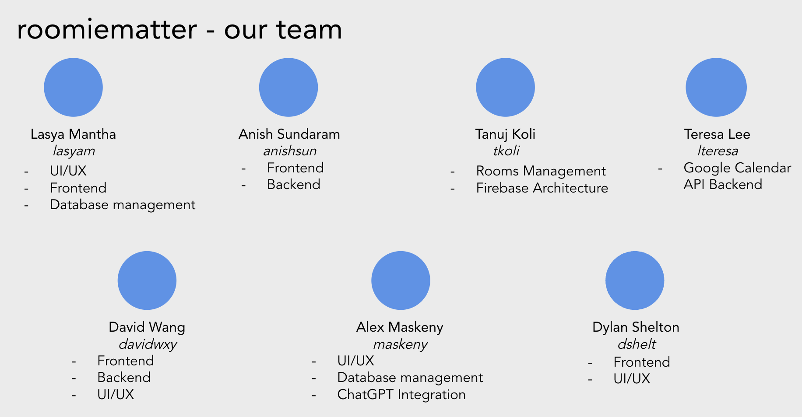

# UM EECS441§3&4 F23 RoomieMatter

| Video  |  Wiki |  Trello  |
|:-----:|:-----:|:--------:|
||||

 <!-- MUST be placed in user-images.githubusercontent.com -->

[video_page]: [[https://youtu.be/sample]](https://youtu.be/zfQ5DVqRz34)
[wiki_page]: [[https://github.com/member/team/wiki](https://github.com/AlexMaskeny/RoomieMatter/wiki)](https://github.com/leeteresamaria/RoomieMatter/wiki)
[agile_page]: [https://trello.com/b/5Bg8azLq/roomiematter441](https://trello.com/invite/b/5Bg8azLq/ATTI3988408eee3e5cbcc50a51288fb4dd0dCB4CC58E/roomiematter441)
